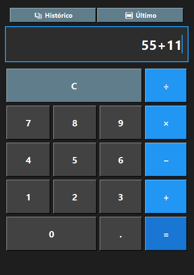

# Calculadora Python Tkinter



Uma aplicação de calculadora simples construída com Python e o framework GUI Tkinter.

## Funcionalidades

### Calculadora Básica
- Operações matemáticas básicas (+, -, ×, ÷)
- Interface moderna com esquema de cores escuro
- Botões responsivos com feedback visual
- Validação de expressões matemáticas
- Tratamento de erros (divisão por zero, expressões inválidas)

### Funcionalidade de Histórico 
- **Histórico Completo**: Visualize todos os cálculos realizados
- **Pesquisa**: Busque por expressões ou resultados específicos
- **Reutilização**: Clique duplo em qualquer item do histórico para usar o resultado
- **Persistência**: O histórico é salvo automaticamente em arquivo JSON
- **Acesso Rápido**: Botão "Último" para inserir o resultado da última operação
- **Gerenciamento**: Limpe o histórico quando necessário

## Arquitetura

O projeto foi refatorado seguindo os **princípios SOLID**, especialmente o princípio da responsabilidade única:

```
Projeto/
├── models/           # Modelos de dados
│   ├── __init__.py
│   └── calculation_entry.py    # Modelo para entradas de cálculo
│
├── services/         # Lógica de negócio
│   ├── __init__.py
│   └── history_manager.py      # Gerenciamento do histórico
│
├── ui/              # Interface do usuário
│   ├── __init__.py
│   └── history_window.py       # Janela de histórico
│
├── utils/           # Utilitários
│   ├── __init__.py
│   └── formatters.py           # Formatação e validação
│
└── main.py             # Arquivo principal
```

### Componentes

#### Models (`models/`)
- **CalculationEntry**: Representa uma entrada de cálculo com expressão, resultado e timestamp

#### Services (`services/`)
- **HistoryManager**: Gerencia operações de histórico (adicionar, buscar, limpar, persistir)

#### UI (`ui/`)
- **HistoryWindow**: Interface da janela de histórico com pesquisa e seleção

#### Utils (`utils/`)
- **ExpressionValidator**: Valida e sanitiza expressões matemáticas
- **NumberFormatter**: Formata números para exibição

## Como Usar

### Funcionalidades Básicas
1. Execute `python main.py`
2. Use os botões numéricos e operadores para criar expressões
3. Pressione "=" para calcular
4. Use "C" para limpar

### Funcionalidades de Histórico
1. **Ver Histórico**: Clique no botão "Histórico" para abrir a janela de histórico
2. **Usar Último Resultado**: Clique em "Último" para inserir o resultado da última operação
3. **Pesquisar**: Digite na caixa de busca para encontrar cálculos específicos
4. **Reutilizar**: Dê duplo clique em qualquer item para usar seu resultado
5. **Limpar**: Use o botão "Limpar Histórico" para remover todos os registros

## Dependências

- **Python 3.6+**
- **tkinter** (incluído na instalação padrão do Python)
- **json** (biblioteca padrão)
- **datetime** (biblioteca padrão)
- **os** (biblioteca padrão)
- **re** (biblioteca padrão)

## Interface

### Calculadora Principal
- **Primeira linha**: Botões de histórico ("Histórico", "Último", "C")
- **Linhas seguintes**: Layout tradicional de calculadora
- **Display**: Campo de entrada para expressões e resultados

### Janela de Histórico
- **Barra de pesquisa**: Para filtrar cálculos
- **Lista de histórico**: Mostra cálculos com horário
- **Botões de ação**: Limpar histórico e atualizar
- **Informações**: Contador de cálculos encontrados

## Segurança

- Validação rigorosa de expressões matemáticas
- Prevenção contra injeção de código
- Sanitização de entrada antes da avaliação
- Tratamento seguro de erros

## Persistência

O histórico é automaticamente salvo em `calculator_history.json` no diretório da aplicação, permitindo que os dados persistam entre sessões.

## Design

- **Tema escuro** moderno
- **Cores azuis** para operadores e ações
- **Tipografia clara** (Segoe UI)
- **Layout responsivo** que se adapta ao redimensionamento

## Princípios Aplicados

- **DRY (Don't Repeat Yourself)**: Funções reutilizáveis para criação de botões
- **SOLID**: Cada classe tem uma responsabilidade específica
- **Separação de responsabilidades**: UI, lógica de negócio e dados separados
- **Modularidade**: Estrutura de pastas organizadas por funcionalidade

---

Desenvolvido com foco em boas práticas de programação e experiência do usuário.


